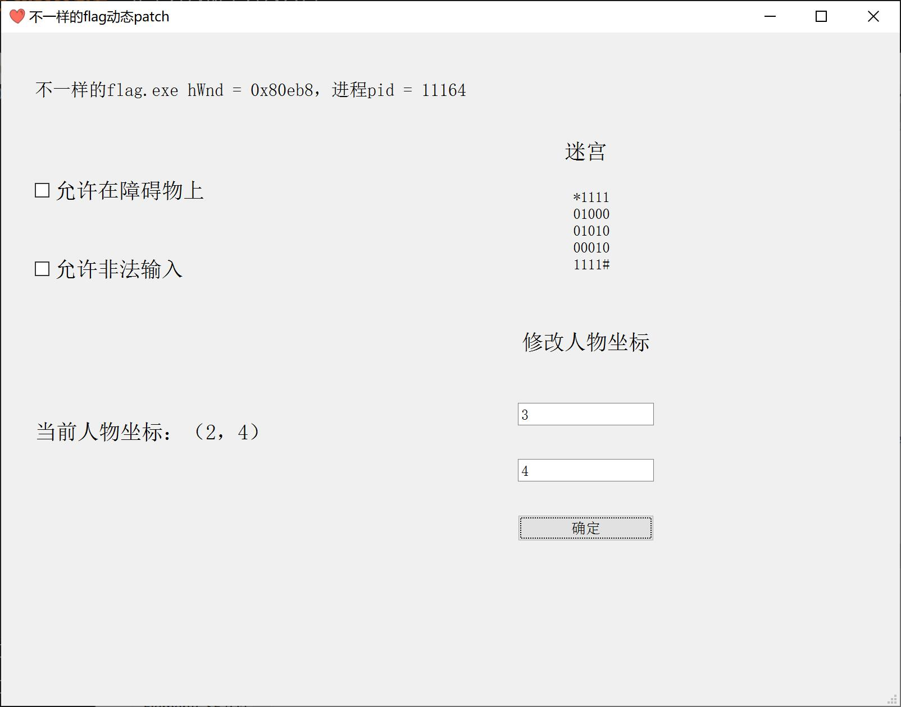
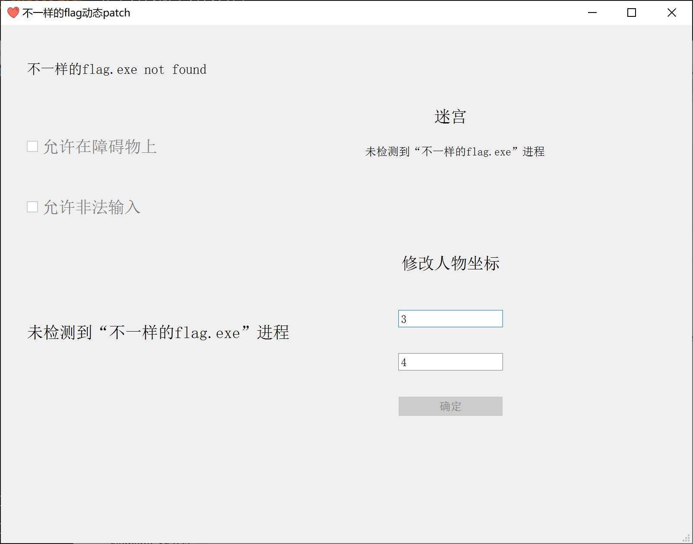

[TOC]

### 目标

希望学习对Windows进程的动态patch，我们选择的exe是**buuoj的“不一样的flag”**。这题是迷宫题的hello world，没有加壳，没有任何代码混淆，且可以把它当成一个超小型的游戏，~~有助于提升信心~~。

为了直观，以GUI的形式提供对目标进程的动态patch功能：

1. 未检测到目标进程，相关的输入控件不可使用。
2. 检测到目标进程时，读取目标进程内存中的数据，显示目标进程信息、迷宫和当前人物的坐标。
3. 检测到目标进程时，提供“允许在障碍物上”、“允许不合法输入”和修改人物坐标功能（这些需求是根据其反汇编代码确定的）。

**作者：[hans774882968](https://blog.csdn.net/hans774882968)以及[hans774882968](https://juejin.cn/user/1464964842528888)**

[本文代码已在GitHub开源](https://github.com/Hans774882968/windows_process_patch_pyqt5)

[本文juejin](https://juejin.cn/post/7115679857421484063/)

效果图：

检测到进程：



未检测到进程：



### 依赖

- spy++：`<visual studio安装路径>\2019\Community\Common7\Tools\spyxx_amd64.exe`。
- 用pyqt5提供的qtdesigner来设计GUI。
- 用pyinstaller打包成exe。
- pywin32和pyqt5：

```
pip install pywin32
pip install PyQt5
pip install PyQt5-tools
pip install pyinstaller
```

pyqt5安装完毕后可以把`<python安装路径>\Lib\site-packages\pyqt5_tools`加到环境变量上。

不想用visual studio+cpp，太臃肿了。所以选择了pywin32。

### 分析

打开IDA，立刻得到反汇编代码。

```c
void main()
{
  char v0; // [sp+17h] [bp-35h]@1
  int v1; // [sp+30h] [bp-1Ch]@1
  int v2; // [sp+34h] [bp-18h]@1
  signed int v3; // [sp+38h] [bp-14h]@2
  signed int i; // [sp+3Ch] [bp-10h]@14
  int v5; // [sp+40h] [bp-Ch]@20

  __main();
  v1 = 0;
  v2 = 0;
  qmemcpy(&v0, _data_start__, 0x19u);
  while ( 1 )
  {
    puts("you can choose one action to execute");
    puts("1 up");
    puts("2 down");
    puts("3 left");
    printf("4 right\n:");
    scanf("%d", &v3);
    if ( v3 == 2 )
    {
      ++v1;
    }
    else if ( v3 > 2 )
    {
      if ( v3 == 3 )
      {
        --v2;
      }
      else
      {
        if ( v3 != 4 )
LABEL_13:
          exit(1);
        ++v2;
      }
    }
    else
    {
      if ( v3 != 1 )
        goto LABEL_13;
      --v1;
    }
    for ( i = 0; i <= 1; ++i )
    {
      if ( *(&v1 + i) < 0 || *(&v1 + i) > 4 )
        exit(1);
    }
    if ( *((_BYTE *)&v5 + 5 * v1 + v2 - 41) == '1' )
      exit(1);
    if ( *((_BYTE *)&v5 + 5 * v1 + v2 - 41) == '#' )
    {
      puts("\nok, the order you enter is the flag!");
      exit(0);
    }
  }
}
```

这道迷宫题很简单，只说结论：通过patch

```c
if ( *((_BYTE *)&v5 + 5 * v1 + v2 - 41) == '1' ) exit(1);
```

实现“允许在障碍物上”。通过patch

```c
if ( v3 != 4 )
LABEL_13:
    exit(1);
if ( v3 != 1 ) goto LABEL_13;
```

实现“允许不合法输入”。

### GUI

打开`<python安装路径>\Lib\site-packages\qt5_applications\Qt\bin`下的`designer.exe`。拖完ui后用pyuic把`.ui`文件（实质上是xml文件）转为`.py`：

```
pyuic5 -o destination.py source.ui
```

其中：

- -o表示生成一个文件。
- `destination.py`是要生成的.py文件。

见“代码”章节的`different_flag_ui.py`。

### Windows进程动态patch

#### 监控进程

因为还需要响应UI，我们需要开一个子线程，pyqt5提供的解决方案是**QThread+pyqtSignal**。子线程的伪代码：

```python
while True:
    监控进程是否存在，然后self.某signal.emit()向主线程发数据
    time.sleep(1)
```

- 子线程不要更新任何ui，ui和业务逻辑要分开。
- pyqtSignal的int对应c语言的signed int，试出bug了才知道的。

可以用手工输入pid的方式来监控进程。但这里我们选择了另一种方式：先`win32gui.FindWindow(wanted_window_classname, wanted_window_title)`获取`hWnd`，然后去拿`pid`。`classname`和`title`可以用visual studio附带的spy++工具来拿。

#### 读取任意个字节

用`ctypes.create_string_buffer()`创建字符串，然后`kernel32.ReadProcessMemory`读取。读取到的value是bytes类型。

`kernel32`，指`kernel32.dll`。

```python
kernel32 = ctypes.windll.LoadLibrary("kernel32.dll")

def readMemStr(hProcess, address, buffLen):
    ReadProcessMemory = kernel32.ReadProcessMemory
    p = ctypes.create_string_buffer(buffLen)
    ReadProcessMemory(
        int(hProcess),
        address,
        p,
        buffLen,
        None)
    return p.value
```

#### 写入任意个字节

网上大多数信息都是写入一个int的，怎样才能写入任意个字节呢？翻了很多乐色信息，终于翻到了参考链接1。用`ctypes.c_char_p(bytes类型的数据)`，传入`kernel32.WriteProcessMemory`。

```python
# data: bytes
def writeMem(hProcess, address, data, buffLen):
    writeProcess = kernel32.WriteProcessMemory
    writeProcess(
        int(hProcess),
        address,
        ctypes.c_char_p(data),
        buffLen,
        None)
    return data
```

### 打包成exe

```
pyinstaller -F -w -i=assets/icon.ico main.py
```

`-i`表示图标文件，图标只支持`.ico`。

### 代码

#### different_flag_ui.py

```python
# -*- coding: utf-8 -*-

# Form implementation generated from reading ui file 'different_flag_ui.ui'
#
# Created by: PyQt5 UI code generator 5.15.4
#
# WARNING: Any manual changes made to this file will be lost when pyuic5 is
# run again.  Do not edit this file unless you know what you are doing.


from PyQt5 import QtCore, QtGui, QtWidgets


class Ui_MainWindow(object):
    def setupUi(self, MainWindow):
        MainWindow.setObjectName("MainWindow")
        MainWindow.resize(800, 600)
        icon = QtGui.QIcon()
        icon.addPixmap(
            QtGui.QPixmap("assets/icon.png"),
            QtGui.QIcon.Normal,
            QtGui.QIcon.Off)
        MainWindow.setWindowIcon(icon)
        self.centralwidget = QtWidgets.QWidget(MainWindow)
        self.centralwidget.setObjectName("centralwidget")
        self.allowObstacle = QtWidgets.QCheckBox(self.centralwidget)
        self.allowObstacle.setGeometry(QtCore.QRect(30, 120, 151, 41))
        font = QtGui.QFont()
        font.setPointSize(14)
        self.allowObstacle.setFont(font)
        self.allowObstacle.setObjectName("allowObstacle")
        self.allowIllegalInput = QtWidgets.QCheckBox(self.centralwidget)
        self.allowIllegalInput.setGeometry(QtCore.QRect(30, 190, 151, 41))
        font = QtGui.QFont()
        font.setPointSize(14)
        self.allowIllegalInput.setFont(font)
        self.allowIllegalInput.setObjectName("allowIllegalInput")
        self.posLabel = QtWidgets.QLabel(self.centralwidget)
        self.posLabel.setGeometry(QtCore.QRect(30, 320, 351, 71))
        font = QtGui.QFont()
        font.setPointSize(14)
        self.posLabel.setFont(font)
        self.posLabel.setObjectName("posLabel")
        self.mazeTag = QtWidgets.QLabel(self.centralwidget)
        self.mazeTag.setGeometry(QtCore.QRect(480, 90, 81, 31))
        font = QtGui.QFont()
        font.setPointSize(14)
        self.mazeTag.setFont(font)
        self.mazeTag.setAlignment(QtCore.Qt.AlignCenter)
        self.mazeTag.setObjectName("mazeTag")
        self.mazeLabel = QtWidgets.QLabel(self.centralwidget)
        self.mazeLabel.setGeometry(QtCore.QRect(410, 140, 231, 101))
        font = QtGui.QFont()
        font.setPointSize(10)
        self.mazeLabel.setFont(font)
        self.mazeLabel.setAlignment(
            QtCore.Qt.AlignHCenter | QtCore.Qt.AlignTop)
        self.mazeLabel.setObjectName("mazeLabel")
        self.xLineEdit = QtWidgets.QLineEdit(self.centralwidget)
        self.xLineEdit.setGeometry(QtCore.QRect(460, 330, 121, 20))
        font = QtGui.QFont()
        font.setPointSize(10)
        self.xLineEdit.setFont(font)
        self.xLineEdit.setMaxLength(19)
        self.xLineEdit.setObjectName("xLineEdit")
        self.yLineEdit = QtWidgets.QLineEdit(self.centralwidget)
        self.yLineEdit.setGeometry(QtCore.QRect(460, 380, 121, 20))
        font = QtGui.QFont()
        font.setPointSize(10)
        self.yLineEdit.setFont(font)
        self.yLineEdit.setMaxLength(19)
        self.yLineEdit.setObjectName("yLineEdit")
        self.modifyPosTag = QtWidgets.QLabel(self.centralwidget)
        self.modifyPosTag.setGeometry(QtCore.QRect(450, 260, 141, 31))
        font = QtGui.QFont()
        font.setPointSize(14)
        self.modifyPosTag.setFont(font)
        self.modifyPosTag.setAlignment(QtCore.Qt.AlignCenter)
        self.modifyPosTag.setObjectName("modifyPosTag")
        self.processInfo = QtWidgets.QLabel(self.centralwidget)
        self.processInfo.setGeometry(QtCore.QRect(30, 30, 641, 41))
        font = QtGui.QFont()
        font.setPointSize(12)
        self.processInfo.setFont(font)
        self.processInfo.setObjectName("processInfo")
        self.modifyButton = QtWidgets.QPushButton(self.centralwidget)
        self.modifyButton.setGeometry(QtCore.QRect(460, 430, 121, 23))
        font = QtGui.QFont()
        font.setPointSize(10)
        self.modifyButton.setFont(font)
        self.modifyButton.setObjectName("modifyButton")
        MainWindow.setCentralWidget(self.centralwidget)
        self.menubar = QtWidgets.QMenuBar(MainWindow)
        self.menubar.setGeometry(QtCore.QRect(0, 0, 800, 22))
        self.menubar.setObjectName("menubar")
        MainWindow.setMenuBar(self.menubar)
        self.statusbar = QtWidgets.QStatusBar(MainWindow)
        self.statusbar.setObjectName("statusbar")
        MainWindow.setStatusBar(self.statusbar)

        self.retranslateUi(MainWindow)
        QtCore.QMetaObject.connectSlotsByName(MainWindow)

    def retranslateUi(self, MainWindow):
        _translate = QtCore.QCoreApplication.translate
        MainWindow.setWindowTitle(_translate("MainWindow", "不一样的flag动态patch"))
        self.allowObstacle.setText(_translate("MainWindow", "允许在障碍物上"))
        self.allowIllegalInput.setText(_translate("MainWindow", "允许非法输入"))
        self.posLabel.setText(_translate("MainWindow", "未检测到“不一样的flag.exe”进程"))
        self.mazeTag.setText(_translate("MainWindow", "迷宫"))
        self.mazeLabel.setText(
            _translate(
                "MainWindow",
                "未检测到“不一样的flag.exe”进程"))
        self.xLineEdit.setPlaceholderText(_translate("MainWindow", "人物x坐标"))
        self.yLineEdit.setPlaceholderText(_translate("MainWindow", "人物y坐标"))
        self.modifyPosTag.setText(_translate("MainWindow", "修改人物坐标"))
        self.processInfo.setText(
            _translate(
                "MainWindow",
                "未检测到“不一样的flag.exe”进程"))
        self.modifyButton.setText(_translate("MainWindow", "确定"))
```

#### trainer.py

```python
from win32api import OpenProcess
from win32con import PROCESS_ALL_ACCESS
from win32process import GetWindowThreadProcessId
import ctypes

kernel32 = ctypes.windll.LoadLibrary("kernel32.dll")


def getProcessHandle(hWnd):
    # 获取窗口pid
    hpid, pid = GetWindowThreadProcessId(hWnd)
    # 获取进程句柄
    hProcess = OpenProcess(PROCESS_ALL_ACCESS, False, pid)
    return hProcess, pid


def readMemVal(hProcess, address, buffLen):
    ReadProcessMemory = kernel32.ReadProcessMemory
    addr = ctypes.c_ulong()
    ReadProcessMemory(
        int(hProcess),
        address,
        ctypes.byref(addr),
        buffLen,
        None)
    return addr.value


def readMemStr(hProcess, address, buffLen):
    ReadProcessMemory = kernel32.ReadProcessMemory
    p = ctypes.create_string_buffer(buffLen)
    ReadProcessMemory(
        int(hProcess),
        address,
        p,
        buffLen,
        None)
    return p.value


def writeMemInt(hProcess, address, data):
    writeProcessInt = kernel32.WriteProcessMemory
    writeProcessInt(
        int(hProcess),
        address,
        ctypes.byref(
            ctypes.c_ulong(data)),
        4,
        None)
    return data


# data: bytes
def writeMem(hProcess, address, data, buffLen):
    writeProcess = kernel32.WriteProcessMemory
    writeProcess(
        int(hProcess),
        address,
        ctypes.c_char_p(data),
        buffLen,
        None)
    return data


# jmp = 0xeb, jnz = 0x75, jz = 0x74
def setAllowObstacle(hProcess, isChecked):
    # 判s[v1][v2] == '1'的跳转
    address = 0x40146f
    if isChecked:
        # jmp short loc_40147D
        writeMem(hProcess, address, b"\xeb\x0c", 2)
    else:
        # jnz short loc_40147D
        writeMem(hProcess, address, b"\x75\x0c", 2)
    val = readMemVal(hProcess, address, 3)
    print(hex(val))  # 小端 75 0c c7


def setAllowIllegalInput(hProcess, isChecked):
    # 判定输入是否合法：4013CF和4013DB
    ad1, ad2 = 0x4013CF, 0x4013DB
    if isChecked:
        # jmp short loc_4013DF
        writeMem(hProcess, ad1, b"\xeb\x0e", 2)
        # jmp short loc_401400
        writeMem(hProcess, ad2, b"\xeb\x23", 2)
    else:
        # jz short loc_4013DF
        writeMem(hProcess, ad1, b"\x74\x0e", 2)
        # jz short loc_401400
        writeMem(hProcess, ad2, b"\x74\x23", 2)
    val = readMemVal(hProcess, ad1, 3)
    print(hex(val))  # 小端 74 0e eb
    val = readMemVal(hProcess, ad2, 3)
    print(hex(val))  # 小端 74 23 eb


def modifyPos(x, y, hProcess):
    esp = 0x60FEB0
    xAddr = esp + 0x30
    yAddr = esp + 0x34
    writeMemInt(hProcess, xAddr, x)
    writeMemInt(hProcess, yAddr, y)
```

#### main.py

```python
from win32gui import FindWindow
import time
from PyQt5.QtWidgets import QApplication, QMainWindow
from PyQt5.QtGui import QIntValidator
from PyQt5.QtCore import pyqtSignal, QThread
from different_flag_ui import Ui_MainWindow
from PyQt5 import QtCore
import sys
from trainer import *

LB, UB = -2147483648, 2147483646
wanted_window_classname = "ConsoleWindowClass"
wanted_window_title = r"不一样的flag.exe"


class MonitorThread(QThread):
    get_proc_signal = pyqtSignal(int, int, int)
    get_maze_signal = pyqtSignal(str)
    get_pos_signal = pyqtSignal(int, int)
    proc_exist_signal = pyqtSignal(bool)

    def __init__(self):
        super().__init__()

    def run(self):
        while True:
            hWnd = FindWindow(wanted_window_classname, wanted_window_title)
            if not hWnd:
                self.get_proc_signal.emit(0, 0, 0)
                self.get_maze_signal.emit("")
                self.get_pos_signal.emit(UB + 1, UB + 1)
                self.proc_exist_signal.emit(False)
            else:
                hProcess, pid = getProcessHandle(hWnd)
                self.get_proc_signal.emit(hWnd, pid, hProcess)
                # 读迷宫字符串
                bs = readMemStr(hProcess, 0x402000, 26)
                self.get_maze_signal.emit(bs.decode("utf-8", "ignore"))
                # 读人物坐标
                esp = 0x60FEB0
                xAddr = esp + 0x30
                yAddr = esp + 0x34
                x = readMemVal(hProcess, xAddr, 4)
                y = readMemVal(hProcess, yAddr, 4)
                self.get_pos_signal.emit(x, y)
                self.proc_exist_signal.emit(True)
            time.sleep(1)


class MainWindow(QMainWindow, Ui_MainWindow):
    def __init__(self, parent=None):
        super(MainWindow, self).__init__(parent)
        self.setupUi(self)

        self.hProcess = 0
        self.pid = 0

        self.allowObstacle.stateChanged.connect(self.allowObstacleChange)
        self.allowIllegalInput.stateChanged.connect(
            self.allowIllegalInputChange)

        self.modifyButton.clicked.connect(self.modifyPos)
        intValidator1 = QIntValidator(LB, UB)
        intValidator2 = QIntValidator(LB, UB)
        self.xLineEdit.setValidator(intValidator1)
        self.yLineEdit.setValidator(intValidator2)

        self.monitor_thread = MonitorThread()
        self.monitor_thread.get_proc_signal.connect(self.set_process_info)
        self.monitor_thread.get_maze_signal.connect(self.set_maze_label)
        self.monitor_thread.get_pos_signal.connect(self.set_pos_label)
        self.monitor_thread.proc_exist_signal.connect(
            self.set_ui_enabled_state)
        self.monitor_thread.start()

    def set_ui_enabled_state(self, fl):
        self.allowObstacle.setEnabled(fl)
        self.allowIllegalInput.setEnabled(fl)
        self.modifyButton.setEnabled(fl)
        if not fl:
            self.allowObstacle.setChecked(False)
            self.allowIllegalInput.setChecked(False)

    def set_process_info(self, hWnd, pid, hProcess):
        self.hProcess = hProcess
        self.pid = pid
        self.processInfo.setText(
            "不一样的flag.exe " +
            ("hWnd = %s，进程pid = %s" % (hex(hWnd), self.pid) if hWnd else
             "not found"))

    def set_maze_label(self, s):
        if not s:
            self.mazeLabel.setText("未检测到“不一样的flag.exe”进程")
            return
        maze_str = "\n".join([s[i * 5:i * 5 + 5] for i in range(5)])
        self.mazeLabel.setText(maze_str)

    def set_pos_label(self, x, y):
        if x == UB + 1:
            self.posLabel.setText("未检测到“不一样的flag.exe”进程")
            return
        self.posLabel.setText("当前人物坐标：（%s，%s）" % (x, y))

    def allowObstacleChange(self):
        isChecked = self.allowObstacle.isChecked()
        # 进程不存在
        if not self.pid:
            return
        print("allowObstacle", isChecked, "pid = %s" % self.pid)
        setAllowObstacle(self.hProcess, isChecked)

    def allowIllegalInputChange(self):
        isChecked = self.allowIllegalInput.isChecked()
        # 进程不存在
        if not self.pid:
            return
        print("allowIllegalInput", isChecked, "pid = %s" % self.pid)
        setAllowIllegalInput(self.hProcess, isChecked)

    def modifyPos(self):
        try:
            x = int(self.xLineEdit.text())
        except BaseException:
            x = 0
        try:
            y = int(self.yLineEdit.text())
        except BaseException:
            y = 0
        modifyPos(x, y, self.hProcess)


if __name__ == "__main__":
    # 本机分辨率较高，使用以下语句即可让按钮大小符合期望
    QApplication.setAttribute(QtCore.Qt.AA_EnableHighDpiScaling)
    app = QApplication(sys.argv)
    x = MainWindow()
    x.show()
    sys.exit(app.exec_())
```

### 参考链接

1. https://www.coder.work/article/4929101